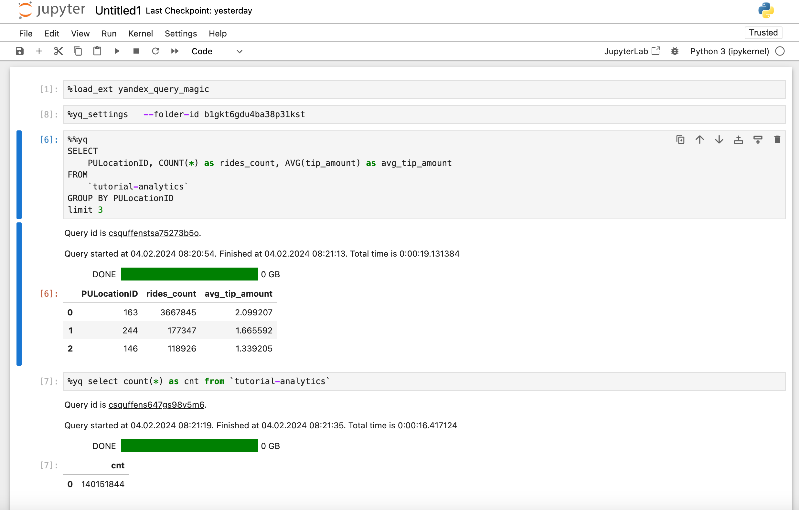

# yandex_query_magic

Yandex Query cell (%%yq) and line (%yq) magics for Jupyter and VSCode



## Motivation

yandex_query_magic was created to:

1. Yandex Query magics for Jupyter Notebook simplify the process of writing and executing queries directly within notebooks, enhancing productivity and interactive data exploration.
2. They enable seamless integration with Yandex Query services, allowing users to effortlessly access and analyze large datasets hosted on Yandex’s cloud platform without leaving the Jupyter environment.
3. By providing shortcuts for common operations and queries, these magics reduce the necessity for boilerplate code, making data analysis workflows more efficient and user-friendly.


## Quick Start

```
%pip install yandex_query_magic --upgrade --quiet
%load_ext yandex_query_magic
%yq_settings   --folder-id b1ggt6geu4aa38p61kst
%yq select 1
```

## Usage

### Global settings
Example:
```%yq_settings   --folder-id b1ggt6geu4aa38p61kst```


By default uses Virtual Machine account key. See [more](https://cloud.yandex.com/en/docs/serverless-containers/operations/sa).

Parameters:
- `--sa-file <sa_key.json>`: If set switch authentication mode to authorized keys. See [more](https://cloud.yandex.com/en/docs/iam/operations/authorized-key/create).
- `--folder-id <folder_id>`: default folder to execute Yandex Query queries.

## Usage Details

### Basic usage

```sql
%yq select 1
```

Where `%yq` is the magic's name and ```select 1``` is the query text.

### Advanced usage

```sql
%yq --folder-id b1ggt6geu4aa38p61kst --name "My query" --description "Test query" --raw-results

select col1, count(*) from table group by col1
```

Parameters:
- `--folder-id <folder_id>`: folder to execute Yandex Query the query.
- `--name "<name>"`: query name.
- `--description "<description>"`: query description.
- `--raw-results`: returns raw unconverted results from Yandex Query. Specification is [here](https://cloud.yandex.com/en/docs/query/api/yql-json-conversion-rules).

### Using jinja2 templates

```sql
%yq <other parameters> --jinja2

select * from table where col1 like "{{val}}"
```

Parameters:
- `--jinja2`: turns on rendering query text with [Jinja](https://jinja.palletsprojects.com/en/3.0.x/templates/) templates. Requires `Jinja2` package to be installed.


## Capturing output

Line Magics can be captured with assignment:

```
# These are equivalent:
varname = %yq <query>
```

Cell magics can be captured specifying variable name at query text start with `<<` operator

```
%%yq
varname <<  <query>
```

To silence a cell, you can stack %%capture:

```
%%capture
%%yq
<query>
```
